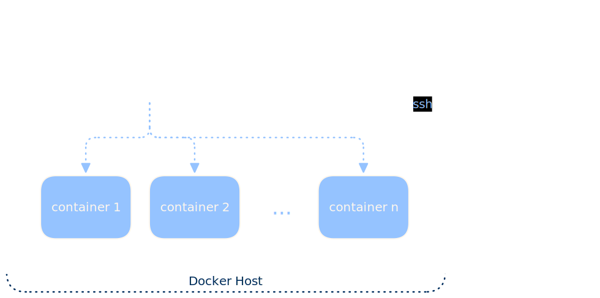
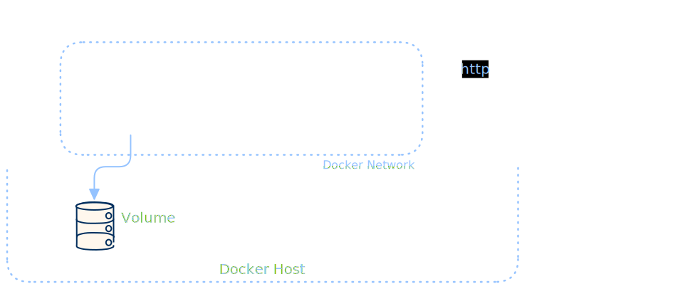

Docker
======

.. _docker:

In diesem Abschnitt werden die Grundlagen von Docker behandelt, die in diesem Tutorial verwendet werden. Diese Grundlagen sind wichtig, um die Konzepte von Kubernetes zu verstehen, sie sind aber auch in DevOps-Alltag fast unverzichtbar.

Installation
------------

Die Installation von Docker ist abhängig vom Betriebsystem, unter Linux Debian 13 ist die Installation mit folgenden Befehlen möglich:

.. code-block:: bash

   $ sudo apt update
   $ sudo apt install docker.io docker-cli docker-buildx docker-compose docker-doc
   $ sudo systemctl status docker

.. tip::

    Mit `sudo systemctl stop docker` wird der Docker-Dienst gestoppt, aber er wird automatisch erneut gestartet, wenn ein Docker-Befehl ausgeführt wird. Der Trigger ist der Zugriff auf der Unix-Socket `/var/run/docker.sock` befindet. Ein normaler Linux-Benutzer hat standardmässig keine Berechtigung, auf diesen Unix-Socket zuzugreifen, und muss zur `docker`-Gruppe hinzugefügt werden, um ohne `sudo` auf Docker zugreifen zu können.

Mit folgenden Befehlen wird ein normaler Benutzer angelegt und zur `docker`-Gruppe hinzugefügt. Dieser Benutzer kann dann ohne `sudo` auf Docker zugreifen.

.. code-block:: bash

    $ sudo useradd --create-home --user-group --shell /bin/bash chris
    $ sudo usermod -aG docker chris
    $ su - chris
    $ groups
    $ docker version
    $ docker run hello-world

Docker Context
--------------

Docker Contexts ermöglichen es, zwischen verschiedenen Docker-Umgebungen zu wechseln, wie zum Beispiel lokalen Docker-Engines oder Remote-Docker-Hosts. Ein Docker Context speichert die Verbindungsinformationen und Einstellungen für eine bestimmte Docker-Umgebung.

.. code-block:: bash

   $ docker context ls
   $ docker context use default

listet alle verfügbaren Docker Contexts auf und wechselt zum `default` Context, der in der Regel die lokale Docker-Engine ist. Weitere Informationen zu Docker Contexts finden sich in der offiziellen Docker-Dokumentation: https://docs.docker.com/engine/manage-resources/contexts/

SSH-Zugriff auf Remote-Docker-Host
----------------------------------

Man kann von einem anderen Rechner auf den oben erstellten Docker-Host wie folgt remote zugreifen:

.. code-block:: bash

   $ ssh-add /path/to/private/ssh/key/schulung
   $ docker context create test --description "Test Docker Context" --docker "host=ssh://root@[ip-address]"
   $ docker context use test
   $ docker version

Der `docker context create`-Befehl erstellt einen neuen Docker Context mit dem Namen `test`, der die Verbindung zu einem Remote-Docker-Host über SSH herstellt. Der `docker context use test`-Befehl wechselt zum neu erstellten Context, und `docker version` zeigt die Docker-Version des Remote-Docker-Hosts an.

.. tip::

    Wichtig dabei ist, dass der SSH-Zugriff auf den Remote-Docker-Host korrekt eingerichtet ist. Der `ssh-add`-Befehl fügt den privaten SSH-Schlüssel zum SSH-Agenten hinzu, damit Docker über SSH auf den Remote-Host zugreifen kann. Wichtig ist auch, dass sowohl der Private als auch der Public Key sich "nebeneinander" im Dateisystem befinden, wenn der `ssh-add`-Befehl ausgeführt wird, damit der SSH-Agent den Schlüssel korrekt verwalten kann.

Unter Windows muss möglicherweise der SSH-Agent manuell gestartet werden, damit der `ssh-add` Befehl korrekt ausgeführt werden kann. Dies kann über die PowerShell als Administrator mit dem folgenden Befehl erfolgen:

.. code-block:: powershell

    Get-Service -Name ssh-agent | Set-Service -StartupType Manual
    Start-Service -Name ssh-agent

Siehe auch https://docs.github.com/en/authentication/connecting-to-github-with-ssh/generating-a-new-ssh-key-and-adding-it-to-the-ssh-agent

Unter Linux muss der SSH-Agent mit dem folgenden Befehlen gestartet werden, bevor `ssh-add` ausgeführt wird:

.. code-block:: bash

    $ eval "$(ssh-agent -s)"

.. tip::

    Mit `ssh-add -L` kann überprüft werden, welche SSH-Schlüssel derzeit vom SSH-Agenten verwaltet werden. Mit `ssh-add -D` können alle Schlüssel aus dem SSH-Agenten entfernt werden.

Wechsle manuell zurück zum `default` Docker Context, um wieder auf die lokale Docker-Engine zuzugreifen und entferne den `test` Docker Context, da er jetzt nicht mehr benötigt wird:

.. code-block:: bash

    $ docker context use default
    $ docker context rm test

Docker Architektur
------------------

Docker hat folgende Client-Server-Architektur:

Über den `docker`-Befehl kommuniziert der Docker-Client mit dem Docker-Daemon, der die Docker-Container verwaltet. Die Kommunikation findet über die `Docker-API <https://docs.docker.com/reference/api/engine/>`_ statt, die lokal über einen Unix-Socket (`/var/run/docker.sock`) erreichbar ist. Die Kommunikation zwischen Docker-Client und Docker-Daemon kann auch über SSH oder TCPS erfolgen.

PostgreSQL Container mit PGAdmin4 als Docker Container
------------------------------------------------------

Nun wollen wir einen PostgreSQL und einen PGAdmin4 Container starten, der PostgreSQL Container speichert die Daten in einem Docker Volume, damit die Daten auch nach einem Neustart des Containers erhalten bleiben. Der PGAdmin4 Container ermöglicht die PostgreSQL-Datenbank über eine Weboberfläche zu verwalten. Die Kommunikation zwischen den beiden Containern erfolgt über ein Docker Netzwerk.

.. code-block:: bash

    $ docker network create pgnet
    $ docker volume create pgdata
    $ docker image pull postgres:18.3-alpine3.23
    $ docker image history postgres:18.3-alpine3.23
    $ docker run -d --name postgres --network pgnet -e POSTGRES_PASSWORD=postgres -v pgdata:/var/lib/postgresql postgres:18.3-alpine3.23
    $ docker container ls
    $ docker logs postgres
    $ docker exec -it postgres psql -U postgres -c "SELECT version();"
    $ docker run -d --name pgadmin4 --network pgnet -p 8080:80 -e PGADMIN_DEFAULT_EMAIL=admin@admin.com -e PGADMIN_DEFAULT_PASSWORD=admin dpage/pgadmin4:9.14.0
    $ docker container ls
    $ docker logs -f pgadmin4

Nun kann im Browser die URL `http://localhost:8080` aufgerufen werden, um die PGAdmin4-Weboberfläche zu öffnen. Dort können die folgenden Anmeldedaten verwendet werden:

+----------------+-----------------+
| E-Mail:        | admin@admin.com |
+----------------+-----------------+
| Passwort:      | admin           |
+----------------+-----------------+

Nun kann eine neue Server-Verbindung in PGAdmin4 erstellt werden, um auf die PostgreSQL-Datenbank zuzugreifen. Die Verbindungsinformationen sind wie folgt:

+-----------+----------+
| Hostname: | postgres |
+-----------+----------+
| Port:     | 5432     |
+-----------+----------+
| Benutzer: | postgres |
+-----------+----------+
| Passwort: | postgres |
+-----------+----------+

Insgesamt haben wir folgende Infrastruktur mit Docker erstellt:

Docker Compose
--------------

Docker Compose ist ein Tool, mit dem man mehrere Docker-Container als eine Anwendung definieren und ausführen kann. Mit Docker Compose können die Container, Netzwerke und Volumes in einer YAML-Datei definiert werden, was die Verwaltung und Orchestrierung von Multi-Container-Anwendungen erleichtert.

.. code-block:: docker

    services:
      postgres:
        image: postgres:18.3-alpine3.23
        environment:
          POSTGRES_PASSWORD: postgres
        volumes:
          - pgdata:/var/lib/postgresql
        networks:
          - pgnet
      pgadmin4:
        image: dpage/pgadmin4:9.14.0
        environment:
          PGADMIN_DEFAULT_EMAIL: admin@admin.com
          PGADMIN_DEFAULT_PASSWORD: admin