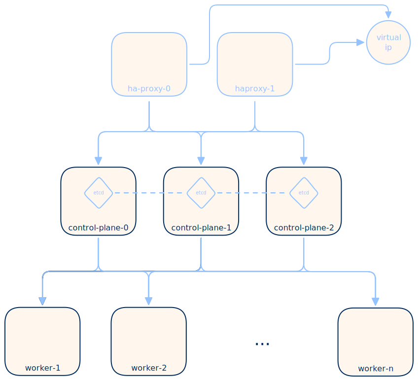

Installation Kubernetes
=======================

.. _kind: https://kind.sigs.k8s.io/
.. _k3s: https://k3s.io/

In diesem Abschnitt werden wir zwei wichtige Kubernetes-Distributionen installieren:

#. `kind`_ oder Kubernetes in Docker, geeignet für lokale Entwicklungs- und Testumgebungen und
#. `k3s`_ eine leichtgewichtige Distribution, gut geeignet um Kubernetes zu lernen aber auch für produktive Umgebungen.

kind - Kubernetes in Docker
---------------------------

`kind`_ ist eine Kubernetes-Distribution, die innerhalb von Docker Containern läuft. Sie ist eine gute Option für die lokale Entwicklung und das Testen von Kubernetes-Anwendungen, da sie einfach zu installieren und zu verwenden ist:

Installation unter Linux:

.. code-block:: console

   $ curl -Lo ./kind https://kind.sigs.k8s.io/dl/v0.31.0/kind-linux-amd64
   $ chmod +x ./kind
   $ sudo mv ./kind /usr/local/bin/

Installation unter Windows (Powershell):

.. code-block:: console

   $ curl.exe -Lo kind-windows-amd64.exe https://kind.sigs.k8s.io/dl/v0.31.0/kind-windows-amd64
   $ Move-Item .\\kind-windows-amd64.exe C:\\some-dir-in-your-PATH\\kind.exe

.. seealso::

   Weitetere Möglichkeiten zur Installation von `kind`_ findet ihr in der offiziellen `Installationsdokumentation <https://kind.sigs.k8s.io/docs/user/quick-start/#installation>`_.

Die Erstellung eines Kubernetes-Clusters mit `kind`_ ist sehr einfach:

.. code-block:: console

   $ kind create cluster

.. error::

   Falls der der obige Befehl fehlschlägt, könnte es daran liegen, dass Docker nicht installiert oder nicht gestartet ist. `kind`_ benötigt Docker, um die Container zu erstellen, in denen die Kubernetes-Nodes laufen.

Nach dem Erstellen des Clusters wird automatisch eine `KUBECONFIG`-Datei erstellt, die die notwendigen Informationen enthält, um mit dem Cluster zu kommunizieren. Diese Datei wird im Verzeichnis `~/.kube/config` gespeichert. Der Ort aus dem die `KUBECONFIG`-Datei geladen wird, kann mit der Umgebungsvariable `KUBECONFIG` überschrieben werden.

Mit dem Befehl Befehl:

.. code-block:: console

   $ kubectl config get-contexts
   CURRENT   NAME        CLUSTER     AUTHINFO                   NAMESPACE
   *         kind-kind   kind-kind   kind-kind
         
können die verfügbaren Kubernetes-Kontexte aufgelistet werden, die in der `~/.kube/config` gespeichert sind. In diesem Fall gibt es nur einen Kontext namens `kind-kind`, der automatisch von `kind`_ erstellt wurde. Dieser Kontext enthält die Informationen, die benötigt werden, um mit dem `kind`_-Cluster zu kommunizieren.

Mit dem folgenden Befehl kann man die Nodes des Clusters auflisten:

.. code-block:: console

   $ kubectl get nodes
   NAME                 STATUS   ROLES           AGE   VERSION
   kind-control-plane   Ready    control-plane   24h   v1.35.0

und erhält natürlich nur einen einzigen Node, der sowohl die Rolle des Control-Planes als auch die Rolle eines Worker-Nodes übernimmt.

Mit dem folgenden Befehl kann ein Cluster wieder entfernt werden:

.. code-block:: console

   $ kind delete cluster
   Deleting cluster "kind" ...
   Deleted nodes: ["kind-control-plane"]

k3s - die leichtgewichtige Kubernetes-Distribution
--------------------------------------------------

`k3s`_ ist eine leichtgewichtige Kubernetes-Distribution. Sie ist eine gute Option für das Lernen von Kubernetes, da sie einfach zu installieren und zu verwenden ist. In der minimalen Konfiguration benötigt `k3s`_ 2 CPUs und 4 GB RAM, was es auch für kleinere Server oder virtuelle Maschinen geeignet macht.

Wir installieren nun die `k3s`_-Kubernetes-Distribution auf einem Debian 13 Linux Server. Dabei benötigst du root-Zugriff auf diesem Server, um die Installation durchzuführen. Logge dich zum Beispiel mit `ssh -i schulung root@[ip]` auf ein Debian 13 Server ein oder öffne mit `sudo bash` eine Root-Shell auf einem Server, auf dem du schon Zugriff hast.

.. note::
      Unter Windows kann man mit `wsl --install Debian` eine Debian 13 Distribution installieren und dann mit `wsl -d Debian` eine Bash öffnen. Vergiss nicht `sudo bash` anschliessen einzugeben, um root-Rechte zu erhalten.

Bist du nun root auf einem Debian 13 Server, kannst du `k3s`_ mit dem folgenden Befehl installieren:

.. code-block:: console

   $ curl -sfL https://get.k3s.io | sh -

.. note::

   Die Deinstallation von `k3s`_ wird mit dem Befehl `k3s-uninstall.sh` durchgeführt.

Mit dem folgenden Befehl kannst du die Nodes des Clusters auflisten:

.. code-block:: console

   $ kubectl get nodes
   NAME                STATUS   ROLES           AGE   VERSION
   debian-4gb-nbg1-1   Ready    control-plane   18s   v1.34.6+k3s1

Ziel dieser k3s Installation
----------------------------

Cluster mit n Nodes
-------------------

HA-Cluster
----------

HA-Cluster mit Load-Balancer
----------------------------

Load-Balancer Konfiguration:

.. code-block:: console

   frontend healthz
      bind :80
      mode http
      monitor-uri /healthz

   frontend k3s-frontend
      bind :6443
      default_backend k3s-backend

   backend k3s-backend
      balance roundrobin
      server k3s-single-control-plane [ip master-0]:6443 check
      server k3s-single-control-plane [ip master-1]:6443 check
      server k3s-single-control-plane [ip master-2]:6443 check
