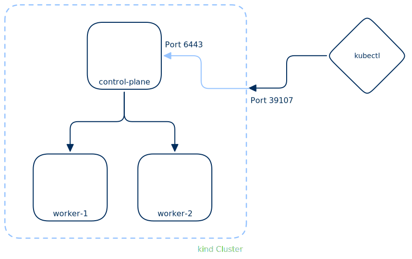

Installation Kubernetes
=======================

.. _kind: https://kind.sigs.k8s.io/
.. _k3s: https://k3s.io/
.. _kubectl: https://kubernetes.io/docs/tasks/tools/install-kubectl/

In diesem Abschnitt werden wir zwei Kubernetes-Distributionen installieren:

#. `kind`_ oder Kubernetes in Docker, geeignet für lokale Entwicklungs- und Testumgebungen und
#. `k3s`_ eine leichtgewichtige Distribution, gut geeignet um Kubernetes zu lernen aber auch für produktive Umgebungen.

kind - Kubernetes in Docker
---------------------------

`kind`_ ist eine Kubernetes-Distribution, die innerhalb von Docker Containern läuft. Sie ist eine gute Option für die lokale Entwicklung und das Testen von Kubernetes-Anwendungen, da sie einfach zu installieren und zu verwenden ist:

Installation unter Linux:

.. code-block:: console

   $ curl -Lo ./kind https://kind.sigs.k8s.io/dl/v0.31.0/kind-linux-amd64
   $ chmod +x ./kind
   $ mv ./kind /usr/local/bin/

Installation unter Windows (Powershell):

.. code-block:: console

   $ curl.exe -Lo kind-windows-amd64.exe https://kind.sigs.k8s.io/dl/v0.31.0/kind-windows-amd64
   $ Move-Item .\\kind-windows-amd64.exe C:\\some-dir-in-your-PATH\\kind.exe

.. seealso::

   Weitetere Möglichkeiten zur Installation von `kind`_ findet ihr in der offiziellen `Installationsdokumentation <https://kind.sigs.k8s.io/docs/user/quick-start/#installation>`_.

Die Erstellung eines Kubernetes-Clusters mit `kind`_ ist sehr einfach:

.. code-block:: console

   $ kind create cluster

.. tip::

   Falls der der obige Befehl fehlschlägt, könnte es daran liegen, dass Docker nicht installiert oder nicht gestartet ist. `kind`_ benötigt Docker, um die Container zu erstellen, in denen die Kubernetes-Nodes laufen.

Nach dem Erstellen des Clusters wird automatisch eine `KUBECONFIG`-Datei erstellt, die die notwendigen Informationen enthält, um mit dem Cluster zu kommunizieren. Diese Datei wird im Verzeichnis `~/.kube/config` gespeichert. Der Ort aus dem diese Konfigurationsdatei geladen wird, kann mit der Umgebungsvariable `KUBECONFIG` überschrieben werden.

kubectl
-------

Nun benötigen wir die Kubernetes-CLI `kubectl`, um mit unserem `kind`_-Cluster zu kommunizieren. `kubectl`_ ist das zentrale Administrationstool für Kubernetes über die Kommandozeile:

.. code-block:: console

   $ apt-get install -y apt-transport-https ca-certificates curl gnupg
   $ curl -fsSL https://pkgs.k8s.io/core:/stable:/v1.36/deb/Release.key | gpg --dearmor -o /etc/apt/keyrings/kubernetes-apt-keyring.gpg
   $ echo 'deb [signed-by=/etc/apt/keyrings/kubernetes-apt-keyring.gpg] https://pkgs.k8s.io/core:/stable:/v1.36/deb/ /' | tee /etc/apt/sources.list.d/kubernetes.list
   $ apt-get update
   $ apt-get install -y kubectl
   $ kubectl version --client

Die offizielle Dokumentation zur `kubectl`-Installation finder man unter https://kubernetes.io/docs/tasks/tools/install-kubectl-linux/#install-using-native-package-management.

Mit dem Befehl Befehl:

.. code-block:: console

   $ kubectl config get-contexts
   CURRENT   NAME        CLUSTER     AUTHINFO                   NAMESPACE
   *         kind-kind   kind-kind   kind-kind
         
können die verfügbaren Kubernetes-Kontexte aufgelistet werden, die in der `~/.kube/config` gespeichert sind. In diesem Fall gibt es nur einen Kontext namens `kind-kind`, der automatisch von `kind`_ erstellt wurde. Dieser Kontext enthält die Informationen, die benötigt werden, um mit dem `kind`_-Cluster zu kommunizieren.

Mit dem folgenden Befehl kann man die Nodes des Clusters auflisten:

.. code-block:: console

   $ kubectl get nodes
   NAME                 STATUS   ROLES           AGE   VERSION
   kind-control-plane   Ready    control-plane   24h   v1.35.0

und erhält natürlich nur einen einzigen Node, der sowohl die Rolle des Control-Planes als auch die Rolle eines Worker-Nodes übernimmt.

Mit `kind`_ erhält man eine Kubernetes-Installation, die für die lokale Entwicklung und das Testen von Anwendungen geeignet ist, da sie sehr einfach zu installieren ist und in Docker Container läuft. Es ist jedoch wichtig zu beachten, dass `kind`_ nicht für den produktiven Einsatz gedacht ist. Mit

.. code-block:: console

   $ docker container ls
   
Sieht man, dass `kind`_ tatsächlich Docker-Container verwendet und jeder Node in einem eigenen Container läuft.

Mit dem folgenden Befehl kann ein Cluster wieder entfernt werden:

.. code-block:: console

   $ kind delete cluster
   Deleting cluster "kind" ...
   Deleted nodes: ["kind-control-plane"]

Mit dem Aufruf

.. code-block:: console

   $ kind create cluster --config ~/kubernetes-tutorial/src/kind/kind-cluster-config.yaml

und folgender Konfiguration in der Datei `kind-cluster-config.yaml`:

.. literalinclude:: ../../src/kind/kind-cluster-config.yaml
   
wird ein `kind`_-Cluster mit einem Control-Plane-Node und zwei Worker-Nodes erstellt. Dies sieht man sofort mit dem `docker`-Befehl:

.. code-block:: console

   $ docker container ls --format "table {{.Image}}\t{{.Names}}\t{{.Ports}}"
   IMAGE                  NAMES                PORTS
   kindest/node:v1.35.0   kind-control-plane   127.0.0.1:39107->6443/tcp
   kindest/node:v1.35.0   kind-worker2         
   kindest/node:v1.35.0   kind-worker

Beachte auch, dass der Port 6443 des Control-Plane-Containers auf den Port 39107 des Host-Systems weitergeleitet wird, was es ermöglicht, von außerhalb des Docker-Containers mit dem Kubernetes-API-Server zu kommunizieren. Dieser Port wurde auch in der `.kube/config`-Datei eingetragen, siehe:

.. code-block:: console

   $ cat ~/.kube/config | yq .clusters[].cluster.server

.. tip::

   `yq` ist ein praktisches Kommandozeilen-Tool, um YAML-Dateien zu filtern und zu ändern. Es kann mit `apt install yq` installiert werden. `yq` ist in der Schulungs VM bereits vorinstalliert.

Insgesamt haben wir mit `kind`_ folgenden Cluster aufgebaut:

Bitte mit `kind delete cluster` den Cluster wieder entfernen, damit wir mit der Installation von `k3s`_ fortfahren können.

k3s - die leichtgewichtige Kubernetes-Distribution
--------------------------------------------------

`k3s`_ ist eine leichtgewichtige Kubernetes-Distribution. Sie ist eine gute Option für das Lernen von Kubernetes, da sie einfach zu installieren und zu verwenden ist. In der minimalen Konfiguration benötigt `k3s`_ 2 CPUs und 4 GB RAM, was es auch für kleinere Server oder virtuelle Maschinen geeignet macht.

.. note::
      Unter Windows kann man mit `wsl --install Debian` eine Debian 13 Distribution installieren und dann mit `wsl -d Debian` eine Bash öffnen. Vergiss nicht `sudo bash` anschliessen einzugeben, um root-Rechte zu erhalten.

`k3s`_ kann mit dem folgenden Befehl in der Minimalkonfiguration installiert werden:

.. code-block:: console

   $ curl -sfL https://get.k3s.io | sh -

Mit

.. code-block:: console

   $ systemctl status k3s

kann überprüft werden, ob der `k3s`-Dienst erfolgreich gestartet wurde. Wenn alles korrekt installiert ist, sollte der Dienst den Status "active (running)" anzeigen.

`k3s`_ kommt mit einem eingebauten `kubectl`-Befehl, der automatisch konfiguriert wird, um mit dem `k3s`-Cluster zu kommunizieren. Mit 

.. code-block:: console

   $ k3s kubectl version --client
   $ k3s kubectl get nodes

kann man zum Beispiel die Version von `kubectl`_ überprüfen und die Nodes des Clusters auflisten.

Möchte man den `kubectl`-Befehl direkt verwenden, ohne jedes Mal `k3s` davor zu schreiben, so kann man zum Beispiel die Datei `/etc/rancher/k3s/k3s.yaml` nach `~/.kube/config` kopieren und dann den `kubectl`-Befehl verwenden um auf `k3s`_ zuzugreifen:

.. code-block:: console

   $ cp /etc/rancher/k3s/k3s.yaml ~/.kube/config
   $ kubectl get nodes

.. note::

   Die Deinstallation von `k3s`_ wird mit dem Befehl `k3s-uninstall.sh` durchgeführt.

Bitte auf allen Schulungs-VMs `k3s`_ *bis auf eine*, zum Beispiel `student-0`, mit dem obigen Befehl `k3s`_ deinstallieren. Nun wird `k3s`_ auf allen Schulungs-VMs erneut als Kubernetes-Worker installiert, die sich mit dem `k3s`_-Control-Plane verbinden auf der verbleibenden Schulungs-VM:

.. code-block:: console

   $ curl -sfL https://get.k3s.io | K3S_URL=https://[ip student-0]:6443 K3S_TOKEN=[token] sh -

Der Token in dem obigen Befehl kann mit folgendem Befehl auf der `student-0` VM ausgelesen werden:

.. code-block:: console

   $ cat /var/lib/rancher/k3s/server/agent-token

.. question::
   Wie kann man die IP-Adresse der `student-0` VM herausfinden, um sie im obigen Befehl zu verwenden?

.. answer::
   Mit dem Befehl `ip addr show dev eth0` kann man die IP-Adresse der `student-0` VM herausfinden.

Was passiert wenn man auf einem Worker-Node den `kubectl get nodes` Befehl ausführt? Warum? Offensichtlich muss ein Worker-Node wie jeder Rechner mit einem Kubernetes-Cluster kommunizieren können, benötigt also die Konfiguration des Control-Planes, um mit diesem zu kommunizieren. Typischerweise wird **NICHT** von den Worker-Nodes aus mit `kubectl`_ gearbeitet, wir man dies aber ausnahmsweise hier tun, um zu zeigen, dass die Worker-Nodes tatsächlich mit dem Control-Plane kommunizieren können.

Wenn man die `./kube/config` Datei des Control-Planes auf einem Worker-Node 1:1 kopiert, kann kann trotzdem nicht mit `kubectl`_ auf dem Worker-Node arbeiten, da die IP Addresse des Control-Planes in der `./kube/config` Datei auf 127.0.0.1 zeigt, also muss hier die IP-Adresse des Control-Planes eingetragen werden, damit die Worker-Nodes mit dem Control-Plane kommunizieren können. Damit kann nun auf allen Worker-Nodes mit `kubectl`_ gearbeitet werden, da sie nun die Konfiguration des Control-Planes haben und mit diesem kommunizieren können. Zum Überprüfen, kann man zum Beispiel auf einem Worker-Node den Befehl `kubectl get nodes` ausführen.

Was passiert, wenn man von einem Worker-Node aus einen Pod startert? Zum Beispiel mit folgendem Befehl:

.. code-block:: console

   $ kubectl run nginx --image=nginx

Mit dem Befehl 

.. code-block:: console

   $ kubectl get pods -o wide

kann man nun sehen, dass der Pod tatsächlich auf einem der Worker-Nodes gestartet wurde, und auch auf welchem Node der Pod läuft. Auf diesem Node kann man zum Beispiel mit `ps aux | grep nginx` sehen, dass tatsächlich ein nginx Prozess läuft, da `k3s`_ die Container-Runtime `containerd` verwendet, die wiederum `runc` verwendet, um die Container zu starten. `runc` startet die Container als Prozesse auf dem Host-System, daher sieht man den nginx Prozess direkt auf dem Node, auf dem der Pod läuft. Mit

.. code-block:: console

   $ ps aux | grep containerd
   $ ps aux | grep runc

kann man die entsprechenden Prozesse auf dem Worker-Node sehen. D.h. Kubernetes startet schon einen Docker Container aber nicht über den `dockerd`-Daemin, sondern direkt über `containerd` und `runc`. Dies ergibt Sinn, da die Docker-API nicht benötigt wird.

Wie kann man nun einen Worker-Node aus dem Cluster entfernen?

.. code-block:: console

   $ kubectl get nodes
   $ kubectl drain --ignore-daemonsets --force [node-name]
   $ kubectl get pods -o wide
   $ kubectl get nodes
   $ kubectl delete node [node-name]
   $ kubectl get nodes

Möchte man den Worker-Node wieder zum Cluster hinzufügen, so kann man mit `systemctl restart k3s-agent` den `k3s`-Agent auf dem Worker-Node neu starten, damit er sich wieder mit dem Control-Plane verbindet.
